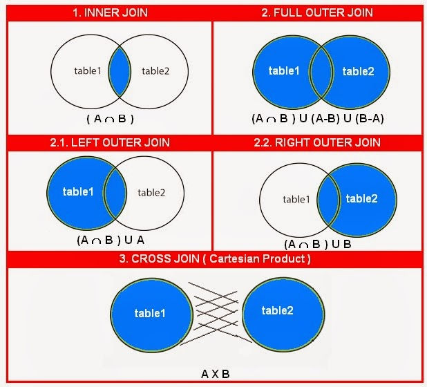

# This is the theortical part of [lesson-17]() in our [SQL course](https://youtube.com/playlist?list=PL7mt2FDjAkPf5lpAnUDwbTYH4tuB-BN-v) _I highly recommnd that you read it!_

## Join types



```
1. Join (Inner join)
2. Outer Join

   2.1 Left join (Left Outer Join)
   2.2 Right join (Right Outer Join)
   2.3 Full join (Full Outer Join)

3. Natural join (Natural Join)
4. Self join (Self Join)
5. Cross join (Cross Join)
```

> # **Inner JOIN or JOIN**

### NOTE: Inner join is completely equivalent to JOIN in MySQL but it's a recommendation to use INNER JOIN as it's more descriptive

---

In this type of `JOIN`, you can get all records of table 1 (Left table to `JOIN statement` by default) and all the records within table 2 (The table right to `JOIN statement`)

For instance, running such query

```sql
select courses.title, students.email from courses join students;
```

result would be something like this table.

|        Title        |           Email           |
| :-----------------: | :-----------------------: |
|  Advanced Laravel   | ahmedosama@sectheater.org |
|  Advanced Laravel   |  mahmoudeladly@gmail.com  |
|  Advanced Laravel   |    ahmedatef@gmail.com    |
|  Advanced Laravel   |   saeedelgaml@gmail.com   |
| database management | ahmedosama@sectheater.org |
| database management |  mahmoudeladly@gmail.com  |
| database management |    ahmedatef@gmail.com    |
| database management |   saeedelgaml@gmail.com   |

It's pretty obvious that all records in students are repeated for each row in courses

similarily if you would do

```sql
select courses.title, instructors.email from courses join instructors;
```

you would find out that all instructors are repeated for each course you have.

In other words, for each element in courses, all students,instructors are repeated according to the number of elements in students or instructors.

Hmm.. maybe if we reversed table orders it would change how it repeats elements, right?

Nop.. In matter of fact, the table that has higher records (In our case courses, it has 6 courses) will be the elected one by SQL to repeat other tables based on it.

So in this very case, `select * from courses join students` is 100% equivalent to `select * from students join courses`

In other case if students or instructors had more rows than courses, the repition would be in the favour of courses, for each student or instructor we have, all courses will be repeated for it.
